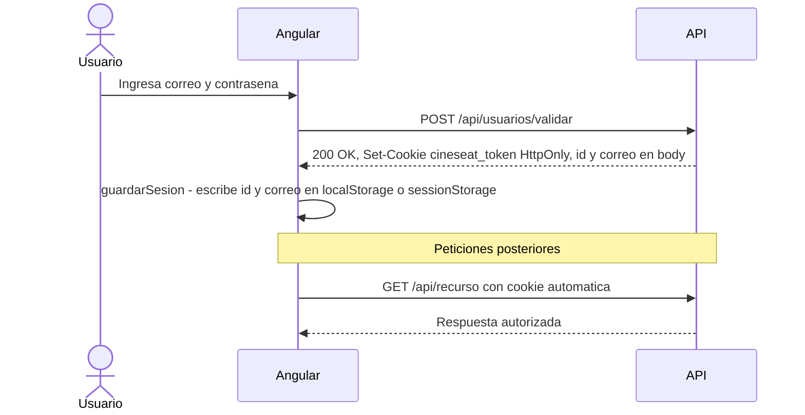

# Autenticación JWT

CineSeat protege sus endpoints y rutas de cliente con **JWT firmados con HMAC SHA-256**. El token se genera al validar credenciales y se escribe directamente como **cookie HttpOnly** en la respuesta HTTP — nunca aparece en el body. El navegador lo envía automáticamente en cada petición posterior al mismo origen.

---

## Flujo completo



---

## Configuración en appsettings.Development.json

El middleware `JwtBearer` y `TokenServicio` leen sus parámetros bajo la clave `Jwt`:

```json
{
  "Jwt": {
    "Llave": "<clave-secreta-minimo-32-chars>",
    "Emisor": "<emisor>",
    "Audiencia": "<audiencia>",
    "ExpiracionHoras": 0.5,
    "ExpiracionHorasExtendida": 168
  }
}
```

> `Llave` debe tener al menos 32 caracteres para que HMAC SHA-256 sea válido. No incluir este archivo en el control de versiones en entornos reales.
>
> `ExpiracionHoras` aplica cuando el usuario no marca "Mantener sesión iniciada" (30 minutos). `ExpiracionHorasExtendida` aplica cuando la marca (7 días = 168 horas).

---

## Backend

`TokenServicio` expone dos métodos:

- `GenerarComoCookie(usuario, sesionMantenida)` — genera el JWT y lo escribe en la respuesta HTTP como cookie `cineseat_token` con `HttpOnly = true` y `SameSite = Strict`. Si `sesionMantenida` es `true`, la cookie incluye `Expires` de 7 días; si no, es una cookie de sesión que se borra al cerrar el navegador.
- `EliminarCookie()` — borra la cookie `cineseat_token` de la respuesta.

El middleware `JwtBearer` está configurado con `OnMessageReceived` para leer el token desde `Request.Cookies["cineseat_token"]` en lugar del header `Authorization`.

`UsuariosController` tiene tres endpoints, todos delegando en `UsuarioServicio`:

| Método | Ruta | Descripción |
|---|---|---|
| `POST` | `/api/usuarios` | Registro de nuevo usuario |
| `POST` | `/api/usuarios/validar` | Login — valida credenciales y establece la cookie |
| `POST` | `/api/usuarios/cerrar-sesion` | Logout — elimina la cookie |

`UsuarioServicio` llama a `tokenServicio.GenerarComoCookie(...)` en `Crear` y `ValidarCredenciales`, y a `tokenServicio.EliminarCookie()` en `CerrarSesion`. El DTO de respuesta es `UsuarioDTO` con los campos `Id` y `Correo`.

---

## Frontend Angular

**`UsuarioService`** es el único servicio de autenticación. Centraliza todas las operaciones relacionadas con la sesión:

- `validarCredenciales()` — llama a `POST api/usuarios/validar`.
- `crear()` — llama a `POST api/usuarios`.
- `guardarSesion(id, correo, sesionMantenida)` — serializa `{ id, correo }` como JSON bajo la clave `cineseat_sesion` y lo escribe en `localStorage` (sesión mantenida) o `sessionStorage` (sesión normal).
- `obtenerDatosSesion()` — lee la clave `cineseat_sesion` de cualquiera de los dos storages, deserializa el JSON y retorna un `UsuarioActual` con `id` y `correo`, o `null` si no hay sesión.
- `haySesionActiva()` — retorna `true` si la clave `cineseat_sesion` existe en alguno de los dos storages.
- `limpiarSesion()` — elimina la clave `cineseat_sesion` de ambos storages sin hacer ninguna llamada HTTP. Método público reutilizable.
- `cerrarSesion()` — llama a `POST api/usuarios/cerrar-sesion` y delega la limpieza de storage a `limpiarSesion()`.

El navegador envía la cookie automáticamente en cada petición al mismo origen por tratarse de una cookie `SameSite=Strict`.

**`AutenticacionInterceptor`** es un `HttpInterceptor` registrado en `app.module.ts` con `multi: true`. Intercepta todas las respuestas HTTP. Si detecta un `status === 401`, llama a `usuarioService.limpiarSesion()` y navega a `/login` pasando `{ state: { sesionExpirada: true } }` en las opciones de navegación. Propaga siempre el error para que el flujo normal de manejo de errores del componente no se vea interrumpido.

**`autenticacionGuard`** es un `CanActivateFn` que protege las rutas que requieren sesión activa. Llama a `usuarioService.haySesionActiva()` y redirige a `/login` con `{ state: { sesionExpirada: true } }` si no hay sesión. Se aplica en `app-routing.module.ts` mediante `canActivate: [autenticacionGuard]`.

**`LoginComponent`** implementa `ngOnInit` con dos responsabilidades:

1. Si `usuarioService.haySesionActiva()` es `true`, redirige directamente a `/cartelera` sin mostrar el formulario.
2. Si `history.state?.sesionExpirada` es `true`, muestra un toast de advertencia con el mensaje "Tu sesión ha expirado." Este estado lo inyectan tanto el interceptor como el guard al navegar a `/login`, por lo que el mismo mecanismo cubre ambos casos.

---

## Mantener sesión iniciada

Cuando el usuario marca "Mantener sesión iniciada" en el login:

- El backend genera una cookie con `Expires` de 7 días (`ExpiracionHorasExtendida: 168`).
- El frontend guarda `{ id, correo }` en `localStorage`, que persiste entre cierres del navegador.

Cuando no marca la opción:

- El backend genera una cookie de sesión sin `Expires`, que el navegador borra al cerrarse.
- El frontend guarda `{ id, correo }` en `sessionStorage`, que se limpia al cerrar la pestaña.

---

## Referencias

- `cineseat.client/src/app/services/usuario.service.ts` — servicio unificado de autenticación y sesión
- `cineseat.client/src/app/guards/autenticacion.guard.ts` — protector de rutas
- `cineseat.client/src/app/interceptors/autenticacion.interceptor.ts` — interceptor HTTP que captura 401 y redirige a login con estado `sesionExpirada`

---

- `CineSeat.Server/Program.cs` — registro del middleware JwtBearer con lectura desde cookie
- `CineSeat.Server/Controllers/UsuariosController.cs` — endpoints de registro, login y logout
- `CineSeat.Server/Services/TokenServicio.cs` — generación y eliminación de la cookie JWT
- `CineSeat.Server/DTOs/UsuarioDTO.cs` — contrato de respuesta con `Id` y `Correo`
