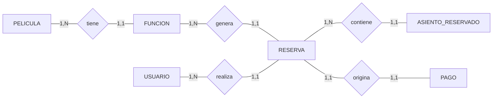

# Modelo de Datos

## Relaciones

| Relación | Cardinalidad | Descripción |
|---|---|---|
| `Pelicula` → `Funcion` | 1:N | Una **Pelicula** puede tener muchas **Funciones** programadas. Cada **Funcion** pertenece a exactamente una **Pelicula**. |
| `Funcion` → `Reserva` | 1:N | Una **Funcion** puede tener muchas **Reservas**. Cada **Reserva** corresponde a exactamente una **Funcion**. |
| `Usuario` → `Reserva` | 1:N | Un **Usuario** puede realizar muchas **Reservas**. Cada **Reserva** pertenece a exactamente un **Usuario**. |
| `Reserva` → `AsientoReservado` | 1:N | Una **Reserva** puede incluir varios **AsientosReservados**. Cada **AsientoReservado** pertenece a exactamente una **Reserva**. |
| `Reserva` → `Pago` | 1:1 | Cada **Reserva** origina exactamente un **Pago**. Cada **Pago** corresponde a exactamente una **Reserva**. |

---



---

## Tablas

### Usuario
| Campo | Tipo | Restricciones | Descripción |
|---|---|---|---|
| Id | int | PK, identity | Identificador único |
| Correo | string (100) | requerido | Correo electrónico del usuario |
| Contrasena | string (60) | requerido | Hash BCrypt de la contraseña |

### Pelicula
| Campo | Tipo | Restricciones | Descripción |
|---|---|---|---|
| Id | int | PK, identity | Identificador único |
| Titulo | string (200) | requerido | Título de la película |
| Genero | string (50) | requerido | Género cinematográfico |
| DuracionMinutos | int | requerido | Duración total en minutos |
| Clasificacion | string (5) | requerido | Clasificación de edad: AA / A / B / B-15 / C / D |
| Director | string (100) | requerido | Nombre del director |
| Sinopsis | string (1000) | requerido | Descripción argumental |
| Portada | byte[] | nullable | Imagen binaria de la portada (`varbinary(max)`) |
| MIMEPortada | string (100) | nullable | MIME type de la imagen (ej. `image/jpeg`) |

### Funcion
| Campo | Tipo | Restricciones | Descripción |
|---|---|---|---|
| Id | int | PK, identity | Identificador único |
| PeliculaId | int | FK → Pelicula | Película que se proyecta |
| Sala | string (50) | requerido | Nombre de la sala (ej. "Sala 1") |
| Fecha | DateOnly | requerido | Fecha de la función |
| Hora | TimeOnly | requerido | Hora de inicio |
| Tipo | string (10) | requerido | Formato de proyección: 2D / 3D / IMAX / VIP |
| Precio | decimal (8,2) | requerido | Precio por asiento |

### Reserva
| Campo | Tipo | Restricciones | Descripción |
|---|---|---|---|
| Id | int | PK, identity | Identificador único |
| UsuarioId | int | FK → Usuario | Usuario que realizó la reserva |
| FuncionId | int | FK → Funcion | Función reservada |
| FechaCreacion | DateTime | requerido | Fecha y hora UTC de la reserva |

### AsientoReservado
| Campo | Tipo | Restricciones | Descripción |
|---|---|---|---|
| ReservaId | int | PK compuesta, FK → Reserva | Reserva a la que pertenece |
| CodigoAsiento | string (3) | PK compuesta | Código del asiento (ej. "A1", "J10") |

### Pago
| Campo | Tipo | Restricciones | Descripción |
|---|---|---|---|
| Id | int | PK, identity | Identificador único |
| ReservaId | int | FK → Reserva, único | Reserva que origina el pago |
| Subtotal | decimal (8,2) | requerido | Precio × cantidad de asientos |
| CargoServicio | decimal (8,2) | requerido | 10% del subtotal |
| Total | decimal (8,2) | requerido | Subtotal + cargo de servicio |
| Fecha | DateTime | requerido | Fecha y hora UTC del pago |

---

## Notas de diseño

**FK de la relación 1:1 en `Pago`**
La FK `ReservaId` vive en `Pago` y no en `Reserva` porque `Pago` es el lado dependiente — no existe sin una `Reserva` previa. Esto permite insertar la reserva primero y el pago después sin necesidad de actualizar ningún campo en `Reserva`.

**Índice único `UQ_Pago_ReservaId`**
Garantiza a nivel de base de datos que no puedan existir dos pagos para la misma reserva. Equivale a:
```sql
CREATE UNIQUE INDEX UQ_Pago_ReservaId ON Pagos (ReservaId);
```
